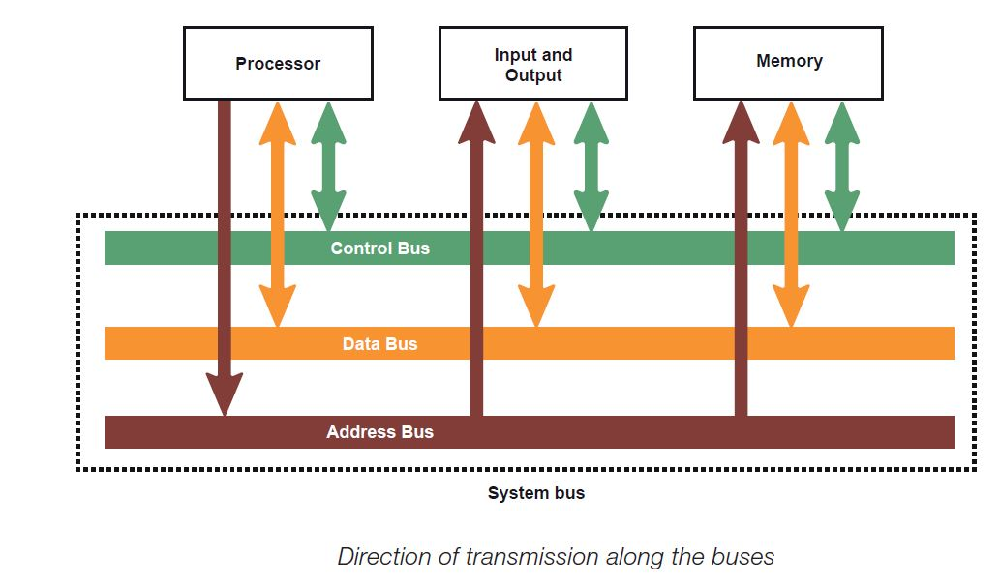

# Buses
**Buses** — the communications channels through which data can be sent around
the computer. It is a set of parallel wires connecting two or more components
of a computer.

The figure below shows that data, address and control buses connect the
[[CPU|processor]], memory and I/O controllers. These three buses are known
collectively as the **system bus**.

 

Each bus is a shared transmission medium, so that only one device can transmit
along a bus at any one time. *Data* and *control signals* travel in both
directions between the processor, memory and I/O controllers. *Addresses*, on
the other hand, travel only one way along the address bus: the processor sends
the address of an instruction, or of data to be stored or retrieved, to memory
or to an I/O controller.

The processor is connected to main memory by three separate buses:
 - [[Address bus]] 
 - [[Data bus]] 
 - [[Control bus]] 
