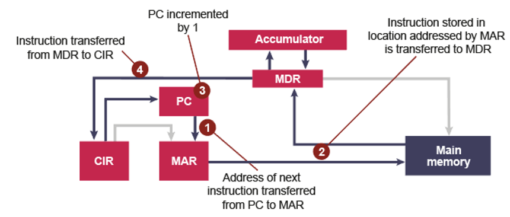
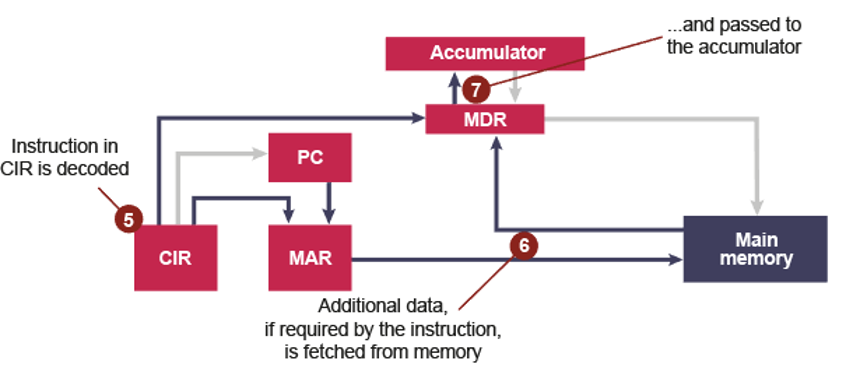
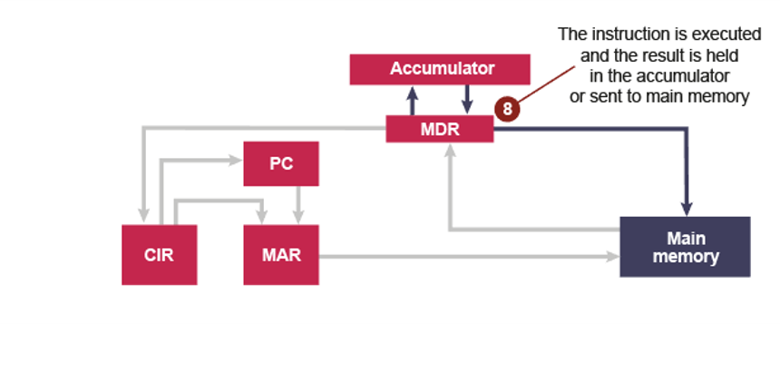

# Fetch-Decode-Execute cycle
**Fetch-Decode-Execute cycle** — a cycle performed by the [[CPU]] of fetching,
decoding and executing an instruction .

## Fetch phase

 

*Note*: Blue lines show connections along which data is travelling in this
stage.

1. The address of the next instruction is copied from the program counter
   ([[PC]]) to the memory address register ([[MAR]]).
2. The instruction held at that address is copied to the memory data register
   ([[MDR]]).
3. Simultaneously, the content of the **PC** is incremented so that it holds the
   address of the next instruction.
4. The contents of the MDR are copied to the current instruction register
   ([[CIR]]).

## Decode phase

 

5. The instruction held in the CIR is decoded.
6. It is split into [[Operand and Opcode|operand and opcode]] to determine the
   type of instruction it is. Additional data, if required, is fetched from
   memory…
7. and passed to the [[Accumulator|accumulator]].

## Execute phase

 

8. The instruction is executed and the result held in accumulator or stored in
   memory.

## Example of the Fetch-Decode-Execute cycle using Assembly
An example can be found [here](https://dld.instructure.com/courses/2903/pages/notes-fetch-decode-execute-cycle?module_item_id=56283).
