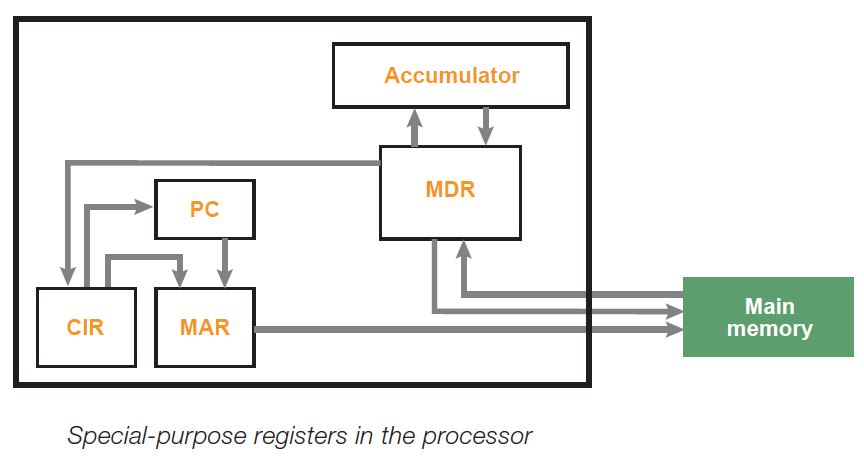

# Registers

**Registers** — special memory cells in the CPU that operate at very high
speed. Results of all arithmetic, logical or shift operations are temporarily
stored in registers. 

Some of the registers are:
 1. [[PC]] 
 2. [[CIR]] 
 3. [[MAR]] 
 4. [[MDR]] 
 5. [[Accumulator|ACC]] 
 6. [[General purpose registers]] 

A simplified diagram showing the connections between these registers is shown
below:
 
