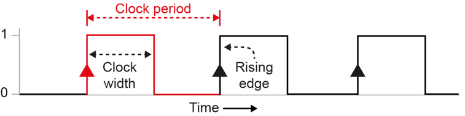

# System clock
**The system clock** — a device that generates a series of signals, switching
between 0 and 1 several million times per second and synchronising [[CPU]]
operations.

Each CPU operation starts as the clock changes from 0 to 1 (or in some systems
from 1 to 0).  The CPU cannot perform operations faster than the clock cycle
(the time the clock takes to go from 0 to 1 and back to 0).

 

All processor activities begin on a **clock pulse**, although some activities
may take more than one clock cycle to complete. 

One clock cycle per second = **1 Hertz** (Hz), and clock speed is measured in
Gigahertz (GHz), about 1 billion cycles per second. Typical speeds for a PC are
between 2 and 4 GHz.

The greater the clock speed, the faster instructions will be executed. A series
of regular signals, switching between ON and OFF, are used to synchronise the
operations of the processor components.

Actions are usually carried out on the **rising edge of the clock**.  Each
action will take a fixed number of cycles to complete.
